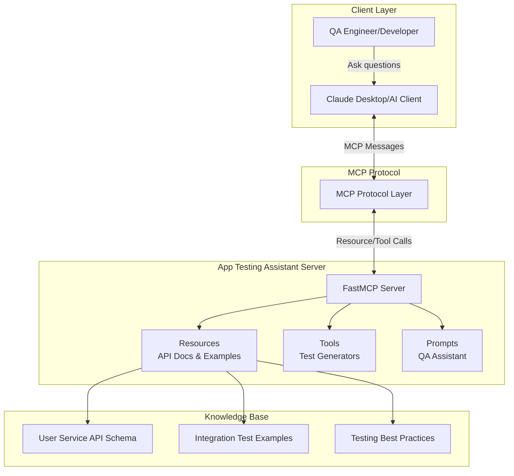
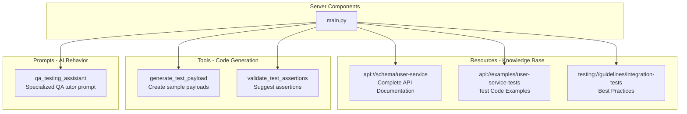
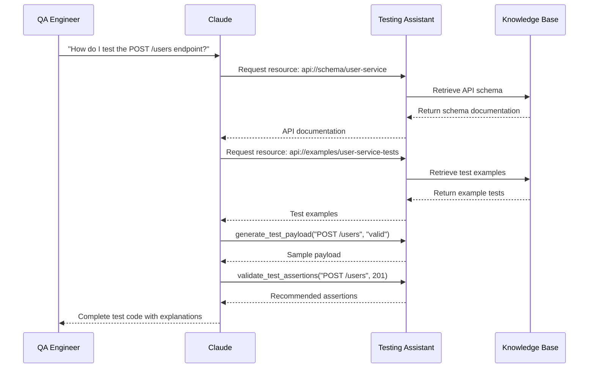
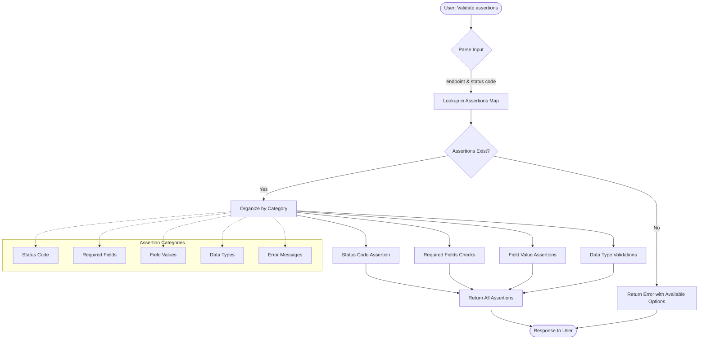
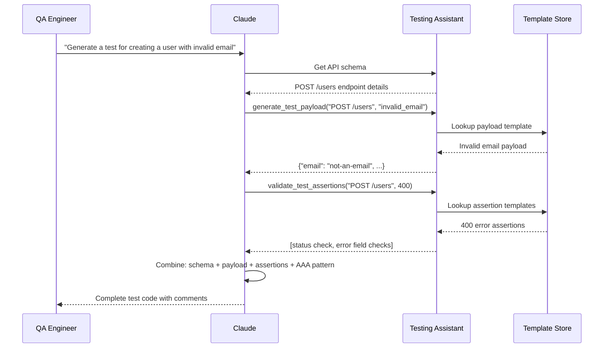
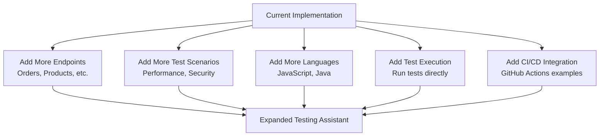

# App Testing Assistant MCP Server - Architecture

## System Architecture



## Component Architecture



## User Interaction Flow



## Tool Flow - Generate Test Payload

```mermaid
flowchart TD
    Start([User: Generate test payload]) --> Input{Parse Input}
    Input -->|endpoint & scenario| Lookup[Lookup in Payload Templates]
    
    Lookup --> Found{Template Exists?}
    
    Found -->|Yes| Extract[Extract Payload for Scenario]
    Extract --> Return[Return Payload JSON]
    
    Found -->|No| Error[Return Error with Available Options]
    
    Return --> End([Response to User])
    Error --> End
    
    subgraph "Payload Templates"
        POST[POST /users<br/>- valid<br/>- missing_email<br/>- invalid_email<br/>- invalid_username]
        PATCH[PATCH /users/{id}<br/>- valid<br/>- change_role<br/>- deactivate]
    end
    
    Lookup -.-> POST
    Lookup -.-> PATCH
```

## Tool Flow - Validate Test Assertions



## Learning Journey Flow

```mermaid
flowchart LR
    subgraph "Phase 1: Discovery"
        A1[Learn API Structure]
        A2[Understand Endpoints]
        A3[Review Request/Response]
    end
    
    subgraph "Phase 2: Examples"
        B1[Study Test Examples]
        B2[Learn AAA Pattern]
        B3[Understand Assertions]
    end
    
    subgraph "Phase 3: Practice"
        C1[Generate Payloads]
        C2[Get Assertion Suggestions]
        C3[Write First Test]
    end
    
    subgraph "Phase 4: Mastery"
        D1[Test Edge Cases]
        D2[Handle Errors]
        D3[Follow Best Practices]
    end
    
    A1 --> A2 --> A3 --> B1
    B1 --> B2 --> B3 --> C1
    C1 --> C2 --> C3 --> D1
    D1 --> D2 --> D3
```



## Resource Data Structure

```mermaid
graph TD
    subgraph "API Schema Resource"
        Schema[API Schema]
        Schema --> Endpoints[Endpoints]
        Endpoints --> POST[POST /users]
        Endpoints --> GET[GET /users/{id}]
        Endpoints --> PATCH[PATCH /users/{id}]
        Endpoints --> DELETE[DELETE /users/{id}]
        
        POST --> ReqFormat[Request Format]
        POST --> ResFormat[Response Format]
        POST --> Validation[Validation Rules]
        POST --> Errors[Error Codes]
    end
    
    subgraph "Test Examples Resource"
        Examples[Test Examples]
        Examples --> Happy[Happy Path Tests]
        Examples --> Invalid[Validation Error Tests]
        Examples --> Conflict[Duplicate Data Tests]
        Examples --> Update[Update Operation Tests]
        
        Happy --> AAA[AAA Pattern]
        AAA --> Arrange
        AAA --> Act
        AAA --> Assert
    end
    
    subgraph "Guidelines Resource"
        Guide[Testing Guidelines]
        Guide --> Structure[Test Structure]
        Guide --> WhatTest[What to Test]
        Guide --> Checklist[Assertion Checklist]
        Guide --> DataMgmt[Test Data Management]
        Guide --> Mistakes[Common Mistakes]
    end
```

## Test Generation Workflow



## Key Design Decisions

### 1. **Resource-Based Knowledge Sharing**
- API schemas as resources provide complete documentation context
- Test examples as resources show real-world patterns
- Guidelines as resources teach best practices
- LLM can reference all materials when answering questions

### 2. **Tool-Based Code Generation**
- `generate_test_payload`: Reduces boilerplate, ensures consistency
- `validate_test_assertions`: Teaches what to verify in tests
- Template-based approach allows easy expansion

### 3. **Prompt Engineering**
- Specialized QA testing assistant prompt sets clear role boundaries
- Instructs how to use resources and tools effectively
- Emphasizes educational approach with explanations

### 4. **Testing Philosophy (AAA Pattern)**
```python
# Arrange: Set up test data
payload = {...}

# Act: Execute API call
response = requests.post(url, json=payload)

# Assert: Verify results
assert response.status_code == 201
```

### 5. **Coverage Areas**
- ✅ Happy path scenarios (201, 200 responses)
- ✅ Validation errors (400 responses)
- ✅ Business logic conflicts (409 responses)
- ✅ Resource not found (404 responses)
- ✅ Edge cases and data types

## Supported API Endpoints

```mermaid
graph LR
    API[User Service API]
    
    API --> Create[POST /users<br/>Create new user]
    API --> Read[GET /users/{id}<br/>Get user details]
    API --> Update[PATCH /users/{id}<br/>Update user]
    API --> Delete[DELETE /users/{id}<br/>Soft delete user]
    
    Create --> C1[201: Success]
    Create --> C2[400: Validation Error]
    Create --> C3[409: Duplicate]
    
    Read --> R1[200: Success]
    Read --> R2[404: Not Found]
    Read --> R3[403: Forbidden]
    
    Update --> U1[200: Success]
    Update --> U2[400: Invalid Data]
    Update --> U3[404: Not Found]
    Update --> U4[409: Conflict]
    
    Delete --> D1[204: No Content]
    Delete --> D2[404: Not Found]
    Delete --> D3[409: Cannot Delete]
```

## Extension Points



## File Structure

```
app-testing-assistant/
├── app_testing_assistant/
│   ├── __init__.py
│   └── main.py                 # Server implementation
│       ├── Resources (3)       # API docs, examples, guidelines
│       ├── Tools (2)           # Payload & assertion generators
│       └── Prompts (1)         # QA assistant behavior
├── pyproject.toml              # Dependencies
├── README.md                   # Documentation
└── ARCHITECTURE.md             # This file
```

## Value Proposition

**For QA Engineers:**
- 📚 Learn API structure interactively
- 🎯 Get instant test code examples
- ✅ Ensure complete test coverage
- 🚀 Accelerate test writing

**For Development Teams:**
- 📖 Living API documentation
- 🔄 Consistent testing patterns
- 👥 Faster onboarding
- 🛡️ Higher quality assurance
