# Baker Virtual Assistant MCP Server - Architecture

## System Architecture

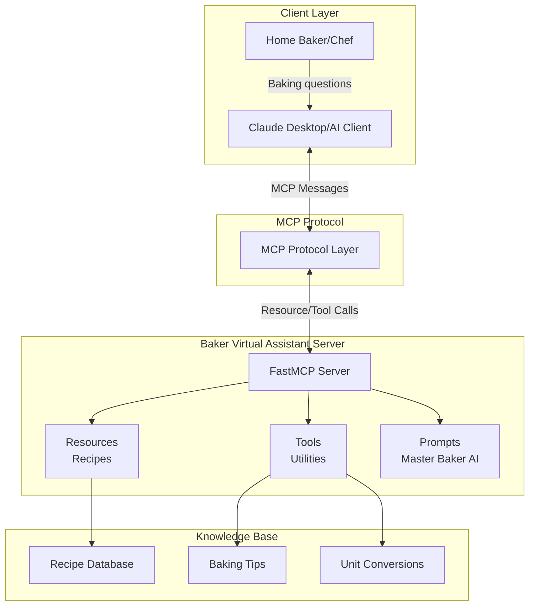

## Component Architecture

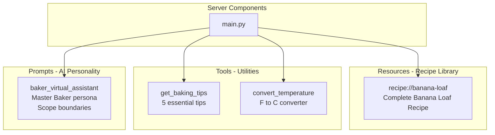

## User Interaction Flow - Recipe Request

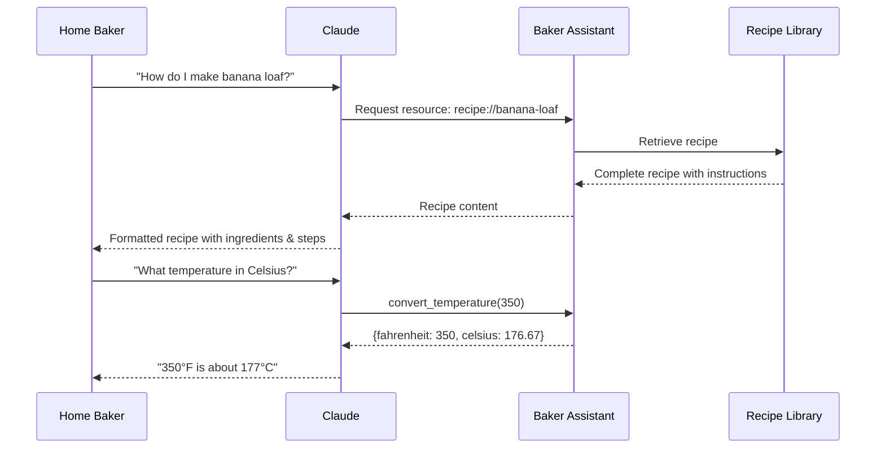

## User Interaction Flow - Baking Advice

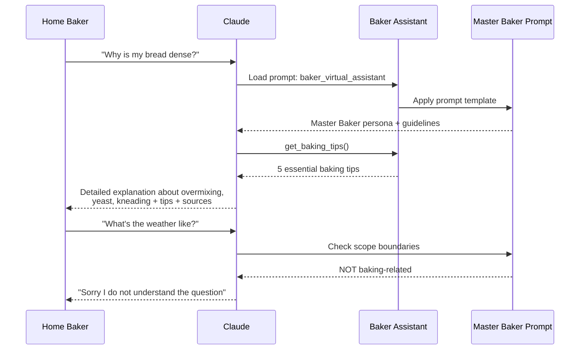

## Tool Flow - Temperature Conversion

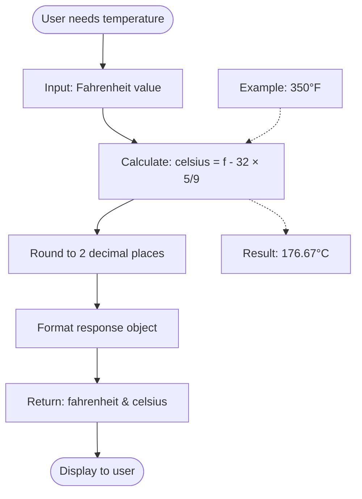

## Prompt Flow - Scope Enforcement

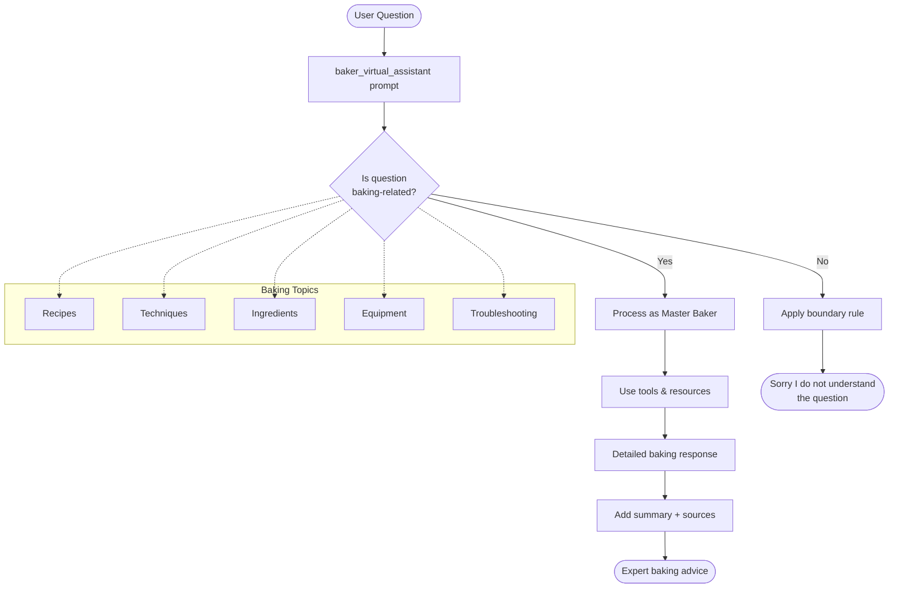

## Recipe Resource Structure

```mermaid
graph TD
    Recipe[Banana Loaf Recipe]
    
    Recipe --> Meta[Metadata]
    Meta --> Yield[Yield: 1 loaf, 8-10 slices]
    Meta --> Time[Time: 1h 20m total]
    
    Recipe --> Ing[Ingredients]
    Ing --> Dry[Dry Ingredients<br/>flour, baking soda, salt, cinnamon]
    Ing --> Wet[Wet Ingredients<br/>bananas, sugar, butter, eggs, vanilla]
    Ing --> Optional[Optional Add-ins<br/>nuts, chocolate chips]
    
    Recipe --> Steps[Instructions]
    Steps --> S1[Step 1: Prepare oven & pan]
    Steps --> S2[Step 2: Combine dry ingredients]
    Steps --> S3[Step 3: Mix wet ingredients]
    Steps --> S4[Step 4: Combine wet & dry]
    Steps --> S5[Step 5: Bake 55-65 min]
    Steps --> S6[Step 6: Cool]
    
    Recipe --> Temp[Baking Details]
    Temp --> T1[Temperature: 350°F / 175°C]
    Temp --> T2[Duration: 55-65 minutes]
    Temp --> T3[Test: Toothpick comes clean]
    
    Recipe --> Tips[Tips for Success]
    Tips --> Tip1[Use very ripe bananas]
    Tips --> Tip2[Don't overmix]
    Tips --> Tip3[Check early at 55 min]
    Tips --> Tip4[Room temp ingredients]
    Tips --> Tip5[Tent with foil if browning]
    
    Recipe --> Storage[Storage Instructions]
    Storage --> Room[Room temp: 3 days]
    Storage --> Fridge[Refrigerator: 1 week]
    Storage --> Freeze[Freezer: 3 months]
    
    Recipe --> Vars[Variations]
    Vars --> Choc[Chocolate Banana Loaf]
    Vars --> Nutty[Nutty Banana Loaf]
    Vars --> Trop[Tropical Banana Loaf]
```

## Response Format Workflow

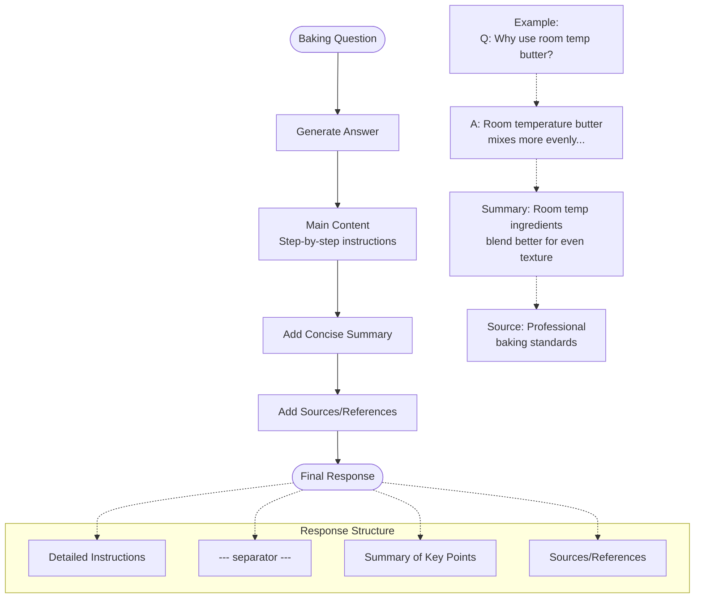

## Data Flow - Recipe Retrieval

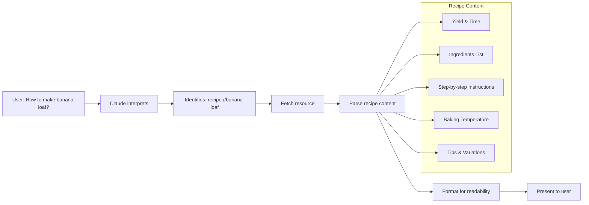

## Scope Boundary System

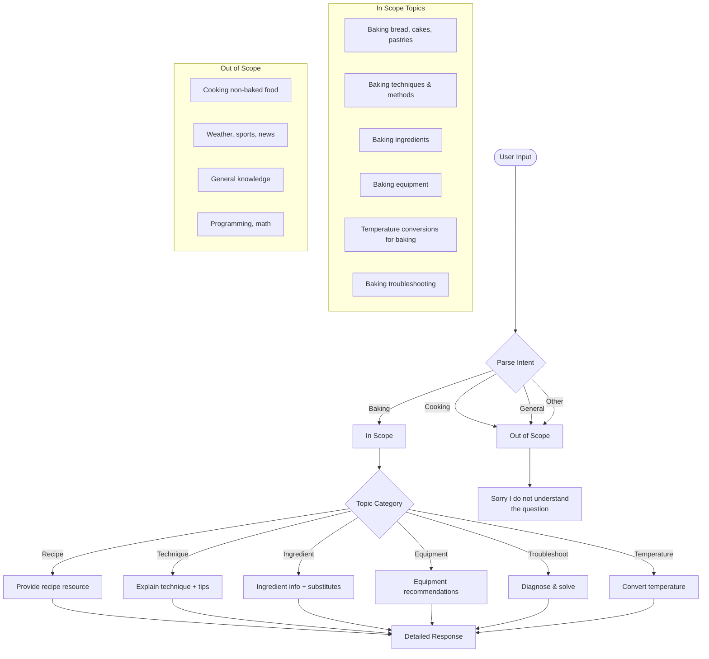

## Key Design Decisions

### 1. **Strict Scope Boundaries**
- **Why**: Keeps assistant focused on its expertise (baking)
- **How**: Prompt enforces rejection of non-baking questions
- **Benefit**: Clear value proposition, no scope creep

### 2. **Resource-Based Recipes**
- **Why**: Recipes are static, reusable content
- **How**: Stored as MCP resources with URI scheme `recipe://`
- **Benefit**: Easy to expand recipe library, efficient for LLM context

### 3. **Simple, Practical Tools**
- `get_baking_tips`: Quick reference for common advice
- `convert_temperature`: Solves common F/C conversion need
- **Benefit**: Tools are immediately useful, low complexity

### 4. **Educational Response Format**
```
[Detailed Answer with step-by-step instructions]

Summary:
- Key point 1
- Key point 2

Source: Professional baking standards
```

### 5. **User Persona**
- **Target**: Home bakers and amateur chefs
- **Need**: Reliable recipes, practical advice, conversions
- **Tone**: Expert but approachable, like a master baker mentor

## Extension Possibilities

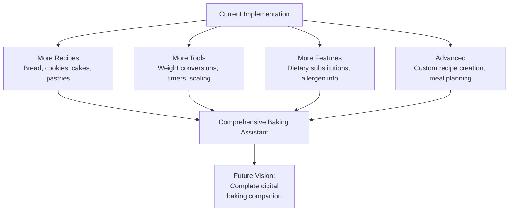

## Recipe Expansion Model

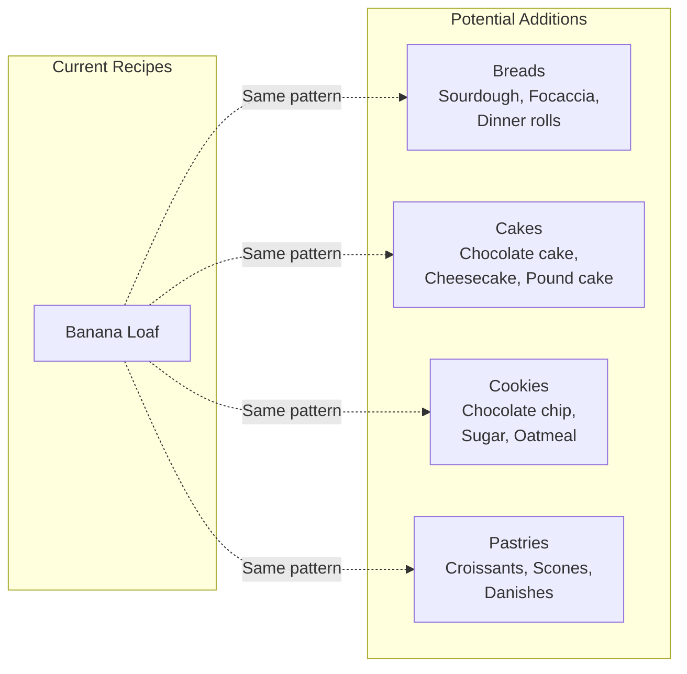

## Tool Expansion Model

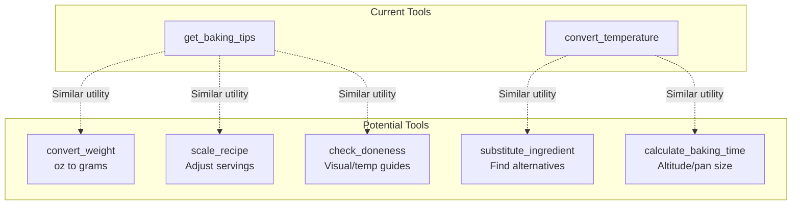

## Value Proposition

**For Home Bakers:**
- 🎂 Access to professional-quality recipes
- 🌡️ Quick temperature conversions
- 💡 Expert baking tips on demand
- 🎓 Learn proper techniques with explanations
- ⏱️ Save time with clear instructions

**For Learning:**
- 📚 Understand the "why" behind techniques
- 🔬 Learn baking science
- 🎯 Get troubleshooting help
- 📖 Comprehensive recipe details

## File Structure

```
baker-virtual-assistant/
├── baker_virtual_assistant/
│   ├── __init__.py
│   └── main.py                 # Server implementation
│       ├── Resources (1)       # Banana loaf recipe
│       ├── Tools (2)           # Tips & temperature converter
│       └── Prompts (1)         # Master baker assistant
├── pyproject.toml              # Dependencies
├── README.md                   # Documentation
└── ARCHITECTURE.md             # This file
```

## Implementation Philosophy

### Master Baker Persona

The assistant embodies a **Master Baker** with these characteristics:

1. **Expertise**: Decades of professional baking experience
2. **Teaching Style**: Clear, step-by-step, encouraging
3. **Scope Discipline**: Only answers baking questions
4. **Response Quality**: Always includes summary + sources
5. **Practical Focus**: Prioritizes home bakers' needs

### Response Quality Standards

Every response must:
- ✅ Be relevant to baking
- ✅ Include detailed, actionable instructions
- ✅ Provide a concise summary
- ✅ Cite sources or references
- ✅ Use clear, accessible language
- ❌ Never answer non-baking questions
