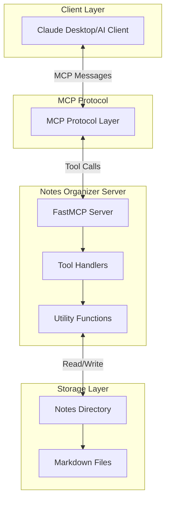
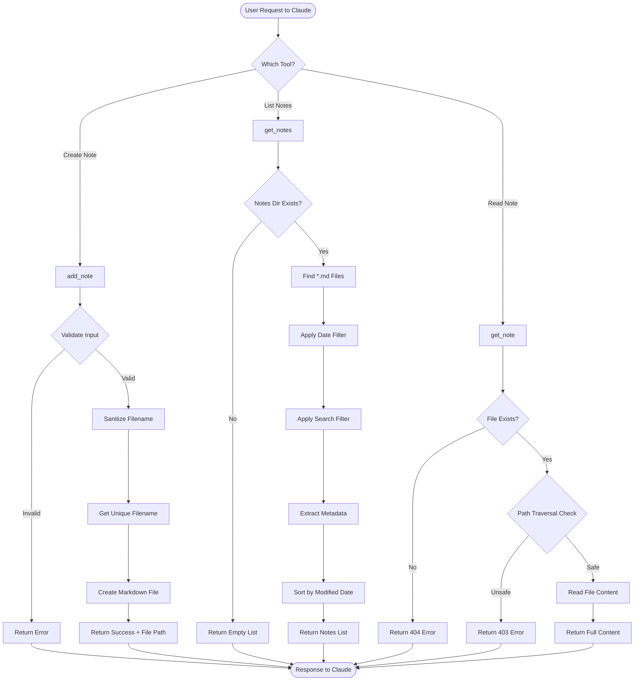
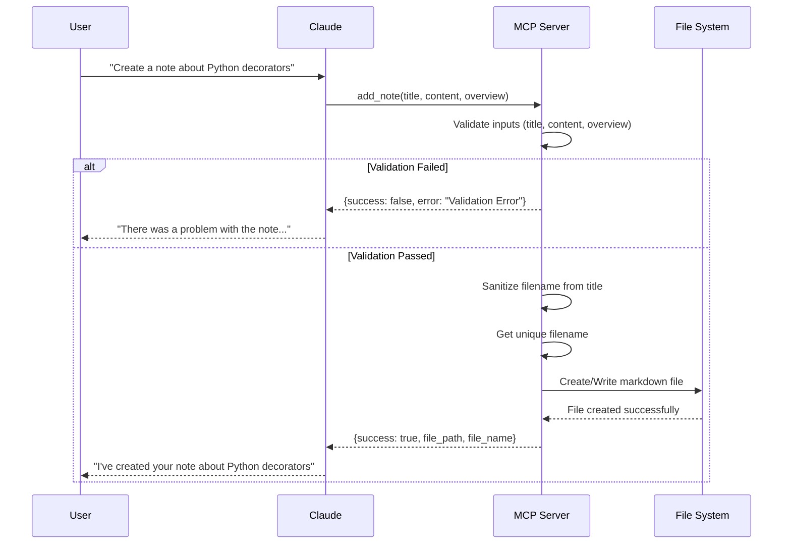
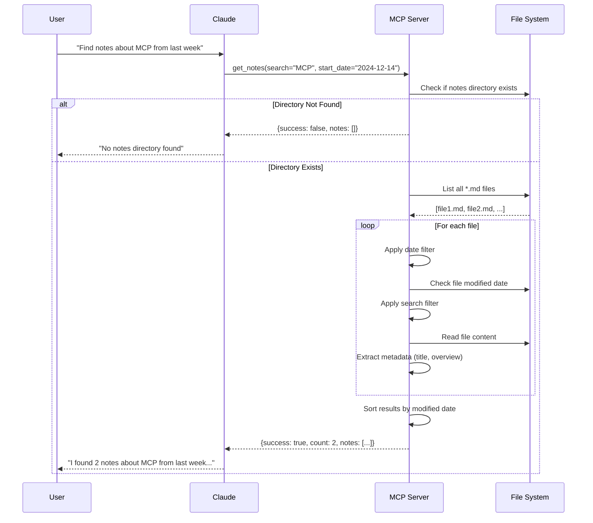
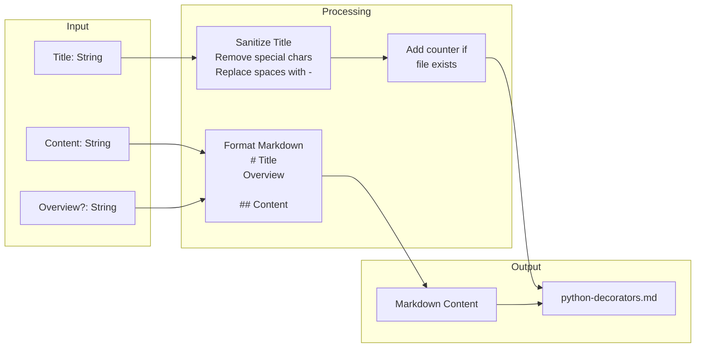
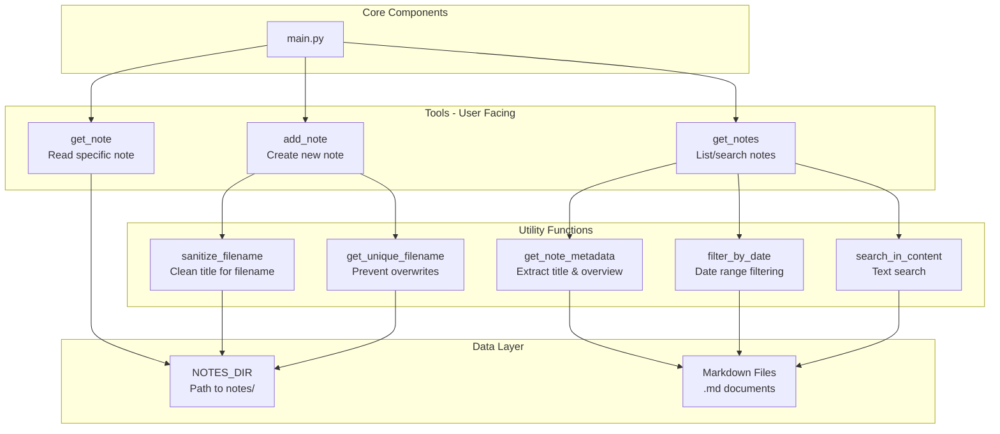

# Notes Organizer MCP Server - Architecture

## System Architecture



## Tool Flow Diagram



## Sequence Diagram - Creating a Note



## Sequence Diagram - Searching Notes



## Data Flow - File Structure



## Component Breakdown



## Key Design Decisions

### 1. **Filename Sanitization**
- Converts titles to safe filenames
- Removes special characters
- Replaces spaces with hyphens
- Ensures uniqueness with numeric suffixes

### 2. **Metadata Extraction**
- Parses first H1 heading as title
- First 150 chars of non-heading content as overview
- Uses file modification time for sorting

### 3. **Security**
- Path traversal prevention in `get_note`
- File size limits (1MB for content)
- Length limits (100 chars title, 255 chars overview)

### 4. **Error Handling**
- Structured JSON responses
- HTTP-style error codes (404, 403, 500)
- Detailed validation messages

### 5. **Flexibility**
- Optional search and date filters
- Auto-generated overview if not provided
- Case-insensitive search

## File Structure

```
notes-organizer/
├── notes/                    # Storage directory
│   ├── MCP.md
│   └── python-decorators.md
├── notes_organizer/
│   ├── __init__.py
│   └── main.py              # Server implementation
├── pyproject.toml           # Dependencies
└── README.md                # Documentation
```
